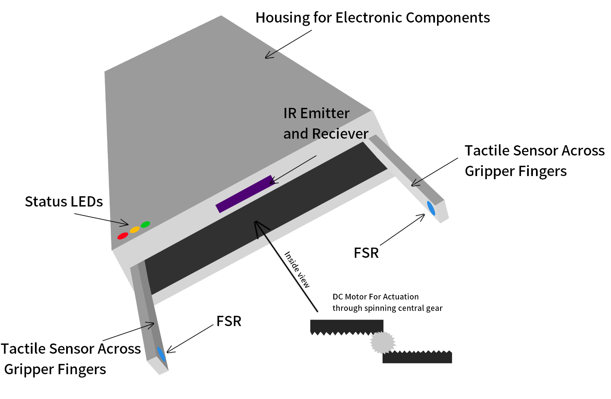

This matrix outlines 100 modular features engineered to satisfy our top 20 high-priority (P8-P10) user needs. Each PRD requirement includes 5 actionable feature details across mechanics, electronics, and software. These concepts serve as mix-and-match building blocks to achieve dynamic force compliance, structural durability, and reliable tactile feedback.

### Grasping Versatility and Orientation

| Requirement / need | Feature | Detail |
| --- | --- | --- |
| Grasp various shapes and sized objects | V-groove notches | Integrated into the inner finger plates to naturally center cylindrical objects. |
| Grasp various shapes and sized objects | Independent multi-segment fingers | Articulated fingers that wrap around irregular geometry. |
| Grasp various shapes and sized objects | Quick-change vacuum suction cup | Attachment for flat or delicate surfaces. |
| Grasp various shapes and sized objects | Internal/External expansion | Mechanisms for handling hollow or solid components[cite: 1]. |
| Grasp various shapes and sized objects | Compliant gel-filled pads | Fingertip pads that deform around complex shapes. |
| Accommodate various orientations | Swivel-mounted finger pads | Self-aligning pads that pivot on a ball joint. |
| Accommodate various orientations | Capacitive tactile sensor arrays | Senses exact object contact location and orientation[cite: 1]. |
| Accommodate various orientations | 360-degree rotary wrist mount | Continuous rotation to adjust the gripper's angle of approach. |
| Accommodate various orientations | Cross-beam IR photodiode pair | Ensures the object is perfectly centered before grasping[cite: 1]. |
| Accommodate various orientations | Symmetrical parallel jaw motion | Ensures uniform contact regardless of object rotation[cite: 1]. |
| Open jaws wide enough for >2in objects | Telescoping linear rail tracks | Extends jaw reach for wider objects. |
| Open jaws wide enough for >2in objects | Extended carbon fiber fingers | Interchangeable long finger attachments. |
| Open jaws wide enough for >2in objects | Dual rack-and-pinion | Doubles the horizontal travel distance per motor rotation. |
| Open jaws wide enough for >2in objects | Scissor-lift internal linkages | Expanding mechanisms to increase aperture. |
| Open jaws wide enough for >2in objects | Adjustable base set-screws | Allows users to manually widen the starting jaw aperture. |

### Mechanical Design and Actuation

| Requirement / need | Feature | Detail |
| --- | --- | --- |
| Linkage design maximizes servo force | Over-center toggle lock | Mechanism that maximizes pinch force at the end of travel. |
| Linkage design maximizes servo force | High-pitch lead-screw | Thread designed for extreme mechanical force multiplication. |
| Linkage design maximizes servo force | Variable-radius cam drive | Provides high speed initially, and high force at the closure point. |
| Linkage design maximizes servo force | Wedge and lever actuation | Traditional actuation systems for optimized grip[cite: 1]. |
| Linkage design maximizes servo force | Pulley and tension system | Kevlar-cable tension system to eliminate mechanical backlash. |
| Manufactured from durable aluminum | CNC-machined unibody | 6061-T6 aircraft-grade aluminum chassis for rigidity. |
| Manufactured from durable aluminum | Stamped sheet metal side-plates | Reduces manufacturing time while maintaining strength. |
| Manufactured from durable aluminum | Hard-anodized surface coating | Prevents wear and scratching on aluminum parts. |
| Manufactured from durable aluminum | Extruded T-slot rails | Forms the primary structural backbone of the gripper. |
| Manufactured from durable aluminum | Waterjet-cut linkage arms | High-tolerance pivoting arms for consistent motion. |
| Material resists flexing under loads | Ribbed structural gussets | Milled into high-stress bracket joints to increase stiffness. |
| Material resists flexing under loads | U-channel finger designs | Cross-sectional designs for the fingers to maximize stiffness. |
| Material resists flexing under loads | Cross-bracing aluminum struts | Bridges the parallel guide rails to prevent twisting. |
| Material resists flexing under loads | Heavy-duty thrust bearings | Placed at the lead-screw base to absorb axial loads. |
| Material resists flexing under loads | FEA-optimized pocketing | Honeycomb patterns maintain rigidity while cutting weight. |
| Grip strength shall be sufficient | MOSFET H-bridge | Bidirectional driver for a high-torque DC motor[cite: 1]. |
| Grip strength shall be sufficient | Planetary gearhead | Attached to the main actuator to multiply holding torque. |
| Grip strength shall be sufficient | Worm and wheel drive | Self-locking drive that naturally resists back-driving under loads[cite: 1]. |
| Grip strength shall be sufficient | Pneumatic cylinder | Optional actuation for extreme-force industrial environments[cite: 1]. |
| Grip strength shall be sufficient | Textured silicone overmolds | High-friction rubber on the grasping surfaces to prevent slipping. |

### Force and Pressure Sensing

| Requirement / need | Feature | Detail |
| --- | --- | --- |
| Sense force across its surface | Dual FSR402 sensors | Thin-film pressure sensors distributed across the gripping area[cite: 1]. |
| Sense force across its surface | QLA414 NanoSensor load cell | Integrated directly into the end-effector base for force sensing[cite: 1]. |
| Sense force across its surface | 6-DoF force/torque sensor | Low-profile sensor mounted between the gripper and arm[cite: 1]. |
| Sense force across its surface | Piezoelectric fabric | Wrapped around the fingers to map pressure changes. |
| Sense force across its surface | Embedded air-bladder system | Measures internal fluid pressure displacement. |
| Force sensor shall give feedback | Real-time feedback loop | Transmits applied force metrics to the host controller[cite: 1]. |
| Force sensor shall give feedback | RGB LED ring | Shifts from green to red based on pressure intensity on the chassis. |
| Force sensor shall give feedback | Integrated OLED screen | Displays a live bar-graph of current grip force. |
| Force sensor shall give feedback | Haptic vibration feedback | Triggered on the user's manual teach-pendant when force limits are hit. |
| Force sensor shall give feedback | Variable-pitch audio buzzer | Changes frequency as gripping force increases. |
| Provide accurate pressure feedback | IDA100 digital amplifier | Processes the raw load cell signals for maximum precision[cite: 1]. |
| Provide accurate pressure feedback | Polynomial interpolation | Multi-point algorithm to flatten the non-linear curve of FSR sensors. |
| Provide accurate pressure feedback | Factory-calibrated lookup tables | Weight lookup tables flashed permanently to the MCU EEPROM. |
| Provide accurate pressure feedback | Floating-point math coprocessor | Dedicated routines for precise force conversion algorithms. |
| Provide accurate pressure feedback | High-speed oversampling | Firmware averages out minor mechanical vibrations for clear data. |
| Provide consistent/repeatable pressure | Automatic tare and zeroing | Sequence triggered every time the system boots up. |
| Provide consistent/repeatable pressure | Thermal drift compensation | Algorithms utilizing an ambient temperature sensor to adjust readings. |
| Provide consistent/repeatable pressure | Regulated 3.3V reference rail | Dedicated power line exclusively for analog sensors. |
| Provide consistent/repeatable pressure | Rigid backing plates | Flat stainless-steel plates for FSR sensors to prevent bending artifacts. |
| Provide consistent/repeatable pressure | Shielded twisted-pair wiring | Blocks EMI from the motor from affecting analog signals. |

### System Control, Safety, and Electronics

| Requirement / need | Feature | Detail |
| --- | --- | --- |
| Enforce soft limits to prevent burnout | Low-side shunt resistor | Combined with op-amp overload comparator to measure current spikes[cite: 1]. |
| Enforce soft limits to prevent burnout | Auto-reverse firmware | Microcontroller auto-reverses jaw direction if unsafe current is reached. |
| Enforce soft limits to prevent burnout | Closed-loop PID control | Clamps maximum PWM output to safe holding torques. |
| Enforce soft limits to prevent burnout | On-board thermistor | Taped to the motor casing to throttle speed if temperatures rise. |
| Enforce soft limits to prevent burnout | Software watchdog timer | Cuts motor power if the encoder stops moving while power is applied. |
| Sensor integrates with MCU ADC | Active instrumentation filter | Custom 2-stage op-amp filter directly feeding the ADC[cite: 1]. |
| Sensor integrates with MCU ADC | Hardware low-pass RC filters | Eliminates high-frequency noise before ADC sampling. |
| Sensor integrates with MCU ADC | External 16-bit I2C ADC chip | Provides higher resolution than the native MCU. |
| Sensor integrates with MCU ADC | Logic level shifters | On-board 5V-to-3.3V converters ensuring safe voltage ranges for analog pins. |
| Sensor integrates with MCU ADC | Integrated Wheatstone bridge | Circuit located locally on the sensor breakout board. |
| Wiring at joints withstands rotation | Miniaturized slip-rings | Rotary connectors installed at the primary wrist joint. |
| Wiring at joints withstands rotation | Stranded silicone-jacketed wires | Ultra-flexible wire designed for repetitive motion. |
| Wiring at joints withstands rotation | Internal wire routing | Wires run through hollow mechanical hinge pins. |
| Wiring at joints withstands rotation | Flat Flexible Cable (FFC) | Curled into a dedicated service loop cavity. |
| Wiring at joints withstands rotation | Nylon braided cable sleeving | Prevents wire abrasion against aluminum edges. |
| Linkages have system to prevent lock-ups | Physical hard-limit switches | Positioned slightly before mechanical bottom-out[cite: 1]. |
| Linkages have system to prevent lock-ups | Mechanical slip-clutch | Spring-loaded clutch on the primary drive shaft. |
| Linkages have system to prevent lock-ups | Software dead-zone buffers | Mapped in firmware to avoid driving the motor into hard stops. |
| Linkages have system to prevent lock-ups | Teflon (PTFE) thread coating | Applied on the lead-screw threads to prevent mechanical binding. |
| Linkages have system to prevent lock-ups | Back-drivable worm gear angle | Allows manual mechanical release upon a complete power failure. |

### Usability, Integration, and Cost

| Requirement / need | Feature | Detail |
| --- | --- | --- |
| Designed for simple assembly process | Glue-free press-fit housing | Modular assembly without permanent adhesives. |
| Designed for simple assembly process | Standardized metric fasteners | Uses a single fastener size (e.g., M3 screws) for the entire build. |
| Designed for simple assembly process | Captive nuts | Embedded directly into the structural brackets for easy bolting. |
| Designed for simple assembly process | Color-coded cables | Wires match directly to colored PCB terminal headers. |
| Designed for simple assembly process | Lever-actuated wire terminals | Solderless push-in terminals for quick electronic connections. |
| Easily accessible to use and integrate | UART debug interface | Streams direct serial telemetry to any host PC[cite: 1]. |
| Easily accessible to use and integrate | ISO 9409-1 mechanical flange | Standardized mounting pattern for universal robot arm compatibility. |
| Easily accessible to use and integrate | ROS node packages | Pre-compiled drivers for the Robot Operating System. |
| Easily accessible to use and integrate | Python API library | Lightweight scripting tool for rapid university environments. |
| Easily accessible to use and integrate | Web-based configuration GUI | Hosted locally via an optional ESP32 Wi-Fi module. |
| Replace components without full teardown | ZIF connectors | Zero Insertion Force connectors for instant swapping of sensor ribbon cables. |
| Replace components without full teardown | Magnetic snap-on fingertip pads | Finger pads that pull off without the need for tools. |
| Replace components without full teardown | Slide-out modular PCB tray | Can be removed without unbolting the gripper from the robot arm. |
| Replace components without full teardown | Externally mounted limit switches | Switches placed on the outside for quick physical replacement[cite: 1]. |
| Replace components without full teardown | Drop-in enclosed motor cartridge | Entire actuator system swaps out as a single pre-assembled unit. |
| Total FOB cost <$300 USD | Unified mainboard PCB | Consolidation of the distributed hardware nodes into a single board. |
| Total FOB cost <$300 USD | Hobby servos | Utilizing off-the-shelf servos with modified firmware instead of industrial actuators. |
| Total FOB cost <$300 USD | 3D-printed polymer covers | Replacing non-load-bearing aluminum covers with cheap plastics. |
| Total FOB cost <$300 USD | PIC18 MCU bus master | Highly affordable central MCU instead of a commercial PLC[cite: 1]. |
| Total FOB cost <$300 USD | Barebones kit option | "Bring Your Own Actuator" option to reduce initial shipping and part costs. |
| Schematic for all parts provided | Open-source KiCad project | Files published on a public GitHub repository. |
| Schematic for all parts provided | Interactive HTML BOM | Bill of Materials linking directly to Digikey/Mouser parts. |
| Schematic for all parts provided | High-contrast silkscreen | PCB layers with explicit pinout and voltage labels. |
| Schematic for all parts provided | Laser-etched block diagram | System diagram etched physically onto the back of the aluminum casing. |
| Schematic for all parts provided | Visual PDF flowcharts | Troubleshooting guides mapping specific errors to schematic nets. |

### Ranked Needs

| Rank | Priority | Requirement / need | Feature | Detail |
| :--- | :--- | :--- | :--- | :--- |
| 1 | P10 | Accommodate various orientations | Capacitive tactile sensor arrays | Senses exact object contact location and orientation across the finger pad[cite: 1]. |
| 2 | P10 | Accommodate various orientations | Cross-beam IR photodiode pair | Ensures the object is perfectly centered via line-of-sight before grasping[cite: 1]. |
| 3 | P10 | Accommodate various orientations | Tactile edge-detection algorithm | Software processes sensor arrays to identify sharp edges for automated repositioning. |
| 4 | P10 | Accommodate various orientations | Center-of-mass estimation logic | Uses multi-point force data differentials to calculate payload balance points. |
| 5 | P10 | Accommodate various orientations | Time-of-Flight (ToF) sensors | Maps distance to target objects to dynamically adjust approach speed and angle. |
| 6 | P10 | Sense force across its surface | Dual FSR402 sensors | Thin-film pressure sensors distributed across the gripping area[cite: 1]. |
| 7 | P10 | Sense force across its surface | QLA414 NanoSensor load cell | Integrated directly into the end-effector base for high-fidelity force sensing[cite: 1]. |
| 8 | P10 | Sense force across its surface | 6-DoF force/torque sensor | Low-profile sensor mounted at the wrist for complex multi-axis force mapping[cite: 1]. |
| 9 | P10 | Sense force across its surface | Multi-zone pressure mapping | High-density FSR matrix that maps exactly where the object touches the gripper. |
| 10 | P10 | Sense force across its surface | Barometric tactile sensing | Embedded air-bladder system that measures internal fluid pressure displacement via MEMS. |
| 11 | P10 | Enforce soft limits to prevent burnout | Low-side shunt resistor | Hardware combined with an op-amp overload comparator to measure current spikes[cite: 1]. |
| 12 | P10 | Enforce soft limits to prevent burnout | Auto-reverse firmware | Microcontroller auto-reverses jaw direction if an unsafe current threshold is reached. |
| 13 | P10 | Enforce soft limits to prevent burnout | Closed-loop PID force control | Software clamps maximum PWM output to maintain safe holding torques without stalling. |
| 14 | P10 | Enforce soft limits to prevent burnout | I2C Motor thermistor | Digital temperature sensor taped to the motor casing to throttle speed if heat rises. |
| 15 | P10 | Enforce soft limits to prevent burnout | Software watchdog timer | Cuts motor power immediately if the control loop hangs or the encoder stops tracking. |
| 16 | P10 | Grip strength shall be sufficient | IMU micro-slip detection | High-pass op-amp filter detects high-frequency acceleration spikes indicating a slip[cite: 1]. |
| 17 | P10 | Grip strength shall be sufficient | Dynamic grip tightening algorithm | Firmware automatically increases holding PWM/force if IMU slipping is detected[cite: 1]. |
| 18 | P10 | Grip strength shall be sufficient | Current-based torque estimation | Calculates theoretical grip force mathematically based on real-time motor current draw. |
| 19 | P10 | Grip strength shall be sufficient | Fragile object compliance logic | Firmware caps maximum PWM force limits specifically for delicate or deformable items. |
| 20 | P10 | Grip strength shall be sufficient | Acoustic slip detection | Integrated MEMS microphone detects the high-frequency friction sound of dropping objects. |
| 21 | P10 | System to prevent lock-ups | Firmware kinematic bounds | Software dead-zone buffers prevent the motor from driving into mechanical hard stops. |
| 22 | P10 | System to prevent lock-ups | Stall-detection timeout | Firmware cuts power if the target encoder position isn't reached within a set millisecond limit. |
| 23 | P10 | System to prevent lock-ups | Hardware limit switch interrupts | Physical switches tied directly to MCU interrupt pins to instantly halt PWM signals[cite: 1]. |
| 24 | P10 | System to prevent lock-ups | Start-up homing routine | Automatically drives jaws to limit switches at 10% speed on boot to verify safe travel range. |
| 25 | P10 | System to prevent lock-ups | Anti-bind current profiling | Detects slow, creeping current spikes indicative of linkage binding and auto-corrects. |
| 26 | P10 | Total FOB cost <$700 USD | PIC18 MCU bus master | Highly affordable central MCU instead of an expensive commercial PLC[cite: 1]. |
| 27 | P10 | Total FOB cost <$700 USD | Hobby servo firmware wrapper | Software layer enabling standard RC servos to behave like industrial actuators. |
| 28 | P10 | Schematic for all parts provided | Interactive HTML BOM | Bill of materials hosted locally on the MCU's web server for instant access. |
| 29 | P10 | Schematic for all parts provided | Open-source KiCad files | PCB design files published directly to a public GitHub repository. |
| 30 | P10 | Wiring withstands rotation | End-effector I2C multiplexer | Consolidates all sensor data into a 4-wire bus to dramatically reduce joint wire fatigue. |
| 31 | P9 | Force sensor shall give feedback | Real-time UART telemetry | Transmits live applied force metrics to the host controller or PC via serial[cite: 1]. |
| 32 | P9 | Force sensor shall give feedback | RGB addressable LED ring | Shifts colors from green to red based on pressure intensity at the end-effector[cite: 1]. |
| 33 | P9 | Force sensor shall give feedback | SPI multi-channel output | Facilitates rapid host robot control system integration with minimal latency[cite: 1]. |
| 34 | P9 | Force sensor shall give feedback | Integrated OLED UI | Displays a live visual bar-graph of current grip force directly on the gripper base. |
| 35 | P9 | Force sensor shall give feedback | Digital I/O binary signaling | Sends simple high/low 5V signals to older PLCs to indicate "grip successful"[cite: 1]. |
| 36 | P9 | Feedback to grasp various shapes | Haptic-response verification | Confirms mechanical resistance matches the expected payload size in firmware. |
| 37 | P9 | Feedback to grasp various shapes | Auto-retry grasp logic | Re-attempts the grasp at a slightly different angle/force if an initial drop is detected. |
| 38 | P9 | Feedback to grasp various shapes | Object drop-detection flagging | Sends a high-priority interrupt alert to the host arm if an object slips out completely. |
| 39 | P9 | Feedback to grasp various shapes | Adaptive material profiles | Users select "soft," "rigid," or "heavy" UI profiles to automatically tune PID constants. |
| 40 | P9 | Material resists flexing | Software compliance compensation | Offsets expected encoder position vs actual position dynamically based on load cell strain. |
| 41 | P8 | Provide accurate pressure feedback | IDA100 digital amplifier | Processes the raw load cell signals digitally for maximum noise reduction[cite: 1]. |
| 42 | P8 | Provide accurate pressure feedback | Polynomial interpolation logic | Multi-point math algorithm to flatten the non-linear voltage curve of cheap FSR sensors. |
| 43 | P8 | Provide accurate pressure feedback | Factory-calibrated lookup tables | Accurate weight arrays flashed permanently to the MCU EEPROM during manufacturing. |
| 44 | P8 | Provide accurate pressure feedback | Kalman filter implementation | Advanced sensor fusion algorithm combining IMU and load cell data for smooth force estimation. |
| 45 | P8 | Provide accurate pressure feedback | High-speed oversampling | Firmware rapidly averages analog reads to decimate minor mechanical vibrations. |
| 46 | P8 | Provide repeatable pressure readings | Automatic tare and zeroing | Firmware sequence automatically triggered every time the system boots up with empty jaws. |
| 47 | P8 | Provide repeatable pressure readings | Thermal drift compensation | Algorithms utilizing an on-board temperature sensor to dynamically offset ADC sensor drift. |
| 48 | P8 | Provide repeatable pressure readings | Regulated 3.3V reference rail | Dedicated, highly stable LDO power line exclusively for powering analog ADCs[cite: 1]. |
| 49 | P8 | Provide repeatable pressure readings | Software state hysteresis | Prevents rapid on/off toggling of the "gripped" state when hovering near a specific force threshold. |
| 50 | P8 | Provide repeatable pressure readings | Continuous baseline monitoring | Software slowly zeroes the baseline weight in the background when jaws are verified open. |
| 51 | P8 | Sensor integrates with MCU ADC | Active instrumentation filter | Custom 2-stage op-amp filter directly feeding the ADC for high-fidelity signals[cite: 1]. |
| 52 | P8 | Sensor integrates with MCU ADC | Hardware low-pass RC filters | Passive components that eliminate high-frequency motor noise before ADC sampling. |
| 53 | P8 | Sensor integrates with MCU ADC | External 16-bit I2C ADC chip | Dedicated module providing much higher analog resolution than the native PIC MCU. |
| 54 | P8 | Sensor integrates with MCU ADC | Logic level shifters | On-board 5V-to-3.3V converters ensuring safe voltage ranges for analog input pins. |
| 55 | P8 | Sensor integrates with MCU ADC | DMA (Direct Memory Access) | Firmware technique allowing ADC to read sensors in the background without tying up CPU cycles. |
| 56 | P8 | Easily accessible to use/integrate | Software GUI dashboard | Real-time desktop visualizer for PIC telemetry, plotting force and current curves[cite: 1]. |
| 57 | P8 | Easily accessible to use/integrate | ROS / ROS2 node packages | Pre-compiled driver packages publishing `JointState` and `WrenchStamped` topics natively. |
| 58 | P8 | Easily accessible to use/integrate | Native Python API library | Lightweight scripting tool allowing simple `gripper.close(force=10)` commands for researchers. |
| 59 | P8 | Easily accessible to use/integrate | RESTful API via ESP32 | Allows the gripper to be commanded via simple HTTP network requests from any language. |
| 60 | P8 | Easily accessible to use/integrate | Modbus RTU protocol support | Legacy industrial communication wrapper for integration with older manufacturing testbeds. |
| 61 | P8 | Linkage maximizes servo force | Dynamic PWM scaling algorithm | Increases power draw specifically at the apex of the mechanical linkage curve. |
| 62 | P8 | Linkage maximizes servo force | Current-controlled holding state | Drops PWM to a minimal holding current once target force is reached to prevent overheating. |
| 63 | P8 | Accommodate >2in objects | Time-of-flight (ToF) modulation | Adjusts jaw travel bounds dynamically in software based on detected object width. |
| 64 | P8 | Replace worn components | Hot-swap I2C sensor detection | Firmware automatically detects and reconfigures if a new sensor pad is plugged in while powered. |
| 65 | P8 | Replace worn components | Firmware sensor ping | Constantly polls sensor health and illuminates a red LED on the specific pad that requires replacement. |
| 66 | P7 | Circuit allows simple conditioning | Pre-calibrated op-amp gains | Fixed-resistor gain stages that require zero manual trimpot tuning by the user. |
| 67 | P7 | Circuit allows simple conditioning | Digital potentiometers | Allows the MCU to auto-tune amplifier gain via software based on object material. |
| 68 | P7 | Circuit allows simple conditioning | Programmable Gain Amplifiers | SPI-based PGAs to change analog resolution dynamically in code. |
| 69 | P7 | Algorithm avoids actuator faults | Ramp-up acceleration profiles | Firmware gently curves motor start/stops (S-curve) to avoid sudden mechanical jolts. |
| 70 | P7 | Algorithm avoids actuator faults | Jerk-limiting software | Caps the maximum rate-of-change of acceleration to protect gearhead teeth. |
| 71 | P7 | Algorithm avoids actuator faults | Predictive maintenance logging | Tracks total motor current over time to mathematically predict impending actuator failure. |
| 72 | P7 | Clear circuit schematics | Embedded web-server diagrams | Gripper hosts a local webpage containing its own wiring diagram. |
| 73 | P7 | Kits undergo quality control | Automated firmware self-test | Factory script that tests all I/O, runs the motor, and validates sensors before shipping. |
| 74 | P7 | Handle dynamic loads | Cycle-counter memory | Saves total open/close cycles to flash memory to notify users when bearings need lubrication. |
| 75 | P7 | Enforced limits prevent burnout | Software settable thermal limits | Allows advanced users to change maximum operating temperature thresholds via the GUI. |
| 76 | P6 | Identify sensor vs actuator fault | Encoder vs force discrepancy | If the encoder moves but force doesn't change, the firmware flags a sensor/drop fault. |
| 77 | P6 | Identify sensor vs actuator fault | Open-circuit ADC detection | ADC pulls to ground if a sensor wire is severed, instantly flagging a hardware connection error. |
| 78 | P6 | Identify sensor vs actuator fault | I2C/SPI bus timeout flagging | Differentiates between a mechanical jam and a digital sensor crash. |
| 79 | P6 | Identify sensor vs actuator fault | IMU cross-validation | Checks if the motor pulls current but the IMU registers zero vibration (indicating a hard motor jam). |
| 80 | P6 | Identify sensor vs actuator fault | Encoded serial error strings | Outputs precise error strings (e.g., `ERR_I2C_FSR_TIMEOUT`) rather than generic red lights. |
| 81 | P6 | Quick installation time | Zero-configuration networking | Gripper automatically requests a DHCP IP address when plugged into a robot's network switch. |
| 82 | P5 | Prevent drift over time | Moving median digital filter | Software filter that aggressively ignores extreme outlier sensor spikes caused by EMI. |
| 83 | P5 | Prevent drift over time | Time-decaying tare adjustment | Slowly pulls the zero-point back to baseline over several hours of uptime. |
| 84 | P5 | Prevent debugging deep issues | Node-specific heartbeat LEDs | Each sensor module has an LED that pulses to visually confirm successful MCU communication. |
| 85 | P5 | Prevent debugging deep issues | On-board SD crash logging | Saves grip event history and fatal errors to a standard text file for easy user analysis. |
| 86 | P5 | Reliable without recalibration | Relative force thresholding | Logic looks for a rapid change in force (delta) rather than an absolute value to ignore drift. |
| 87 | P5 | Function consistently under load | Dynamic clock scaling | Downclocks the MCU processor speed to reduce heat generation during heavy continuous usage. |
| 88 | P5 | Clear assembly instructions | Wizard-mode setup | GUI features a step-by-step digital configuration wizard upon first boot. |
| 89 | P4 | Firmware shall be up to date | OTA (Over the Air) updates | Wi-Fi integration allows wireless flashing of new firmware versions without cables. |
| 90 | P4 | Firmware shall be up to date | Dual-bank safe rollback | Bootloader partition that automatically restores the old firmware if an update fails. |
| 91 | P4 | Firmware shall be up to date | API version checking | Python library automatically pings GitHub to warn users if their gripper firmware is outdated. |
| 92 | P4 | Firmware shall be up to date | MD5 checksum verification | Ensures firmware payloads are perfectly intact before overwriting the MCU memory. |
| 93 | P4 | Firmware shall be up to date | Post-update auto-calibration | Forces a complete sensor baseline reset automatically after any firmware update is applied. |
| 94 | P1 | Work easily with existing hardware | Standard PWM servo emulation | Firmware allows the gripper to be controlled just like a basic RC hobby servo (0-5V pulse). |
| 95 | P1 | Work easily with existing hardware | I2C Slave mode | Allows the gripper to act as a dumb peripheral directly commanded by a master robot arm. |
| 96 | P1 | Integrate with MCU platforms | Arduino IDE library | Open-source C++ library provided for students using standard Arduinos. |
| 97 | P1 | Options for preexisting components | Motor-driver abstraction layer | Software architecture allows users to easily swap the default H-bridge code for their own drivers. |
| 98 | P1 | Mount to different bases | Inverse kinematics library | Includes Python helper functions to calculate gripper offset transforms for custom arms. |
| 99 | P3 | Requires no special tools | Software auto-leveling | Calibrates parallel jaw alignment entirely in software to avoid mechanical set-screw tweaking. |
| 100 | P3 | Support different manufacturers | Configurable gear-ratio variables | Users can adjust gear ratios in a config file to support 3rd-party motors and linkages. |

## Documentation

Our group conducted a feature brainstorming session on September 22nd at 7 PM. Aakash, Jared, Emmanuel and Sakiya met over Discord. Meeting over Discord allowed us to communicate ideas in real time while sharing our screens to share competitor products and technical documents we came across. The shared document allowed us to create and build on each other’s ideas rapidly. We drew our list of requirements from the  User Needs and Benchmarking, and Product Requirements assignments. We also drew inspiration from grippers that we have seen both in labs around campus and industrial environments.  
We chose to group features thematically, then by the user needs that they satisfy, and then by function. Our final format is displayed on our team’s website. The four categories we ended up with were Mechanical Design and Actuation, Force and Pressure Sensing, System Control and Safety, and Integration. 
To apply rankings to our top ideas, we utilized the priority weighting system (P1-10) that we used in our product requirements document. Instead of giving each feature an individual value, we broke them down into categories of whether they solve a critical problem. For example, features that addressed the P10 requirement of “sensing force across its surface” were ranked as very high priority since it came from our interview with PhD candidate Rajdeep Adak. On the other side, lower ranked needs like universal mounting adapters were ranked lower due to not being extremely pertinent to the core values we wanted to focus on. Our main focuses are dynamic force compliance, durability, and highly reliable sensor feedback loops.  
Another aspect our group started thinking about was software applications which we included in our top 100 rankings.  Hardware and electronics alone wouldn't be able to achieve our goals for what we would consider a “smart” gripper. We began to talk about and include an emphasis on firmware, digital filtering, and control algorithms to feature in our top 100 ideas. 

## Product Concepts

